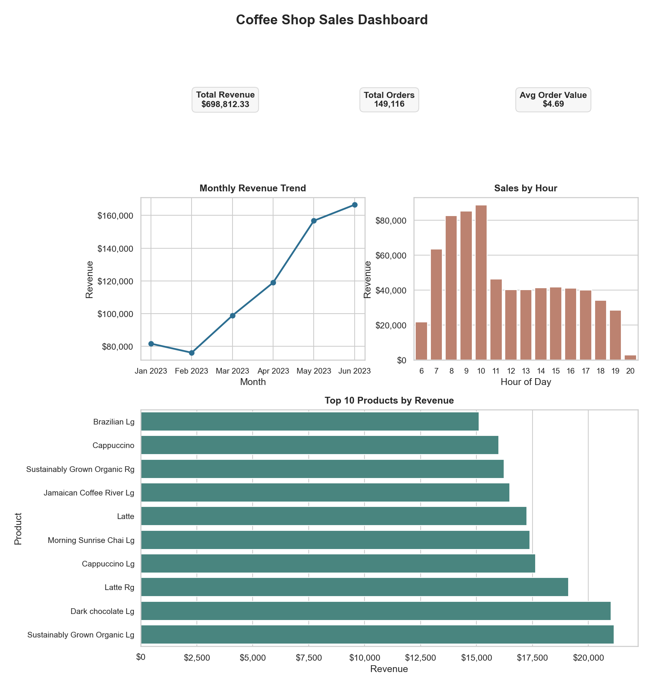

# Coffee Shop Analytics ☕

Data analysis project on coffee shop transactions using Python and SQL.

## Dashboard Preview



## Project Summary 📌

- Built an end-to-end analytics pipeline on 149,116 coffee shop transactions.
- Engineered business features (`revenue`, `month`, `hour`, `day_of_week`) for KPI and trend analysis.
- Produced executive visuals including a combined dashboard and individual chart exports.
- Identified demand concentration: 48.59% of revenue occurs during 8-10 AM and 2-3 PM.
- Quantified product concentration: top 5 products contribute 13.78% of total revenue.
- Measured strong growth: monthly revenue increased 103.83% from Jan to Jun 2023.

## Overview

This project cleans transaction-level sales data, engineers analysis fields, and produces KPI summaries and dashboard-ready outputs.

## Dataset 🗂️

- Source file: data/coffee_shop_sales_transactions.csv
- Processed file: data/coffee_shop_sales_enriched.csv
- Grain: one row per transaction
- Current size: 149,116 transactions

## What This Project Does ⚙️

- Removes duplicate rows
- Removes rows with missing values
- Creates derived columns: revenue, month, hour, day_of_week
- Calculates KPI metrics: total revenue, total orders, average order value
- Builds analysis views: revenue by month, top products by revenue, sales by hour

## Outputs 📦

- Dashboard image: outputs/charts/coffee_shop_dashboard.png
- Individual chart: outputs/charts/revenue_over_time.png
- Individual chart: outputs/charts/sales_by_hour.png
- Individual chart: outputs/charts/top_products_by_revenue.png
- Enriched dataset: data/coffee_shop_sales_enriched.csv
- SQL query pack: sql/queries.sql

## Key Insights 🔍

- Peak demand window: 8-10 AM and 2-3 PM contributes 48.59% of total revenue.
- Product concentration: the top 5 products account for 13.78% of total revenue.
- Growth trend: monthly revenue increased from $81,677.74 in Jan 2023 to $166,485.88 in Jun 2023, a 103.83% increase.

## Business Recommendations 💡

- Prioritize staffing and inventory during 8-10 AM and 2-3 PM peaks.
- Protect top products with strong in-stock availability and bundling offers.
- Plan capacity for continued demand growth based on month-over-month trend direction.

## Project Structure

- data/ -> raw and cleaned datasets
- notebooks/ -> Python analysis
- sql/ -> SQL queries
- outputs/ -> charts and dashboard

## Tech Stack 🛠️

- Python
- Pandas
- Matplotlib
- Seaborn
- SQL

## Reproducibility ▶️

Install dependencies:

```bash
pip install -r requirements.txt
```

Run analysis pipeline:

```bash
python scripts/coffee_shop_analysis.py
```

## SQL Queries 🧠

Analysis queries are available in sql/queries.sql, including:

- Total revenue and average order value
- Revenue by month
- Top products by revenue
- Sales by hour and day of week


